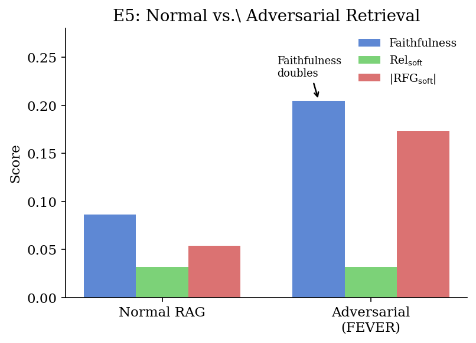
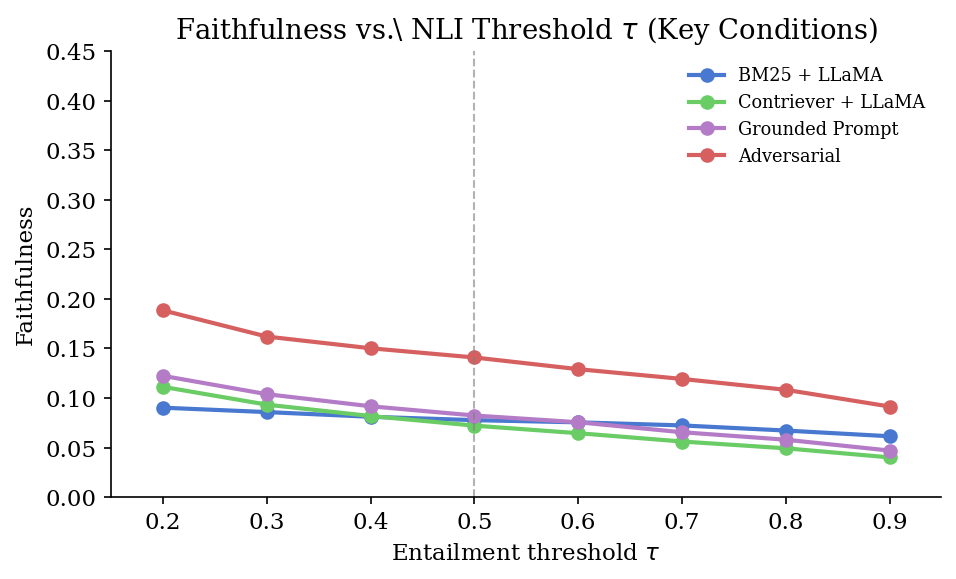

# Evaluating Faithfulness and Attribution in Retrieval-Augmented Generation Systems

**Boston University CS — NLP Final Project (Spring 2026)**

> *Does a RAG system actually use its retrieved documents, or does it silently fall back on parametric memory?*

[](https://www.python.org/)
[](LICENSE)
[]()

---

## Overview

We present a comprehensive empirical evaluation of **faithfulness and attribution** in RAG systems using three custom metrics and five controlled experiments. Our pipeline measures whether language model outputs are actually grounded in retrieved evidence — not just whether they are factually correct.

### Key Findings

| Finding | Result |
|---|---|
| Plain prompting faithfulness | ~0.08–0.10 (very low) |
| Grounded prompt vs. Plain | +12% relative faithfulness |
| Chain-of-Thought vs. Plain | **−24% relative** (counterintuitive) |
| Adversarial FEVER passages | Faithfulness **doubles** (calibration failure) |
| Human IAA (Cohen's κ) | **0.74** (Substantial) |
| NLI vs. Human gold (κ) | **−0.18** (NLI under-counts correct abstention) |

---

## Pipeline Architecture

```
Query
  │
  ▼
Retriever (BM25 or Contriever)
  │  top-k passages
  ▼
Generator (LLaMA-3.1-8B or Mistral-7B)
  │  generated answer
  ▼
Claim Extractor (sentence splitter)
  │  {c₁, c₂, ..., cₙ}
  ▼
NLI Scorer (cross-encoder/nli-deberta-v3-base)
  │  entailment probabilities
  ▼
Metrics: Faithfulness · Soft Rel · RFG
```

---

## Metrics

Three metrics defined at the claim level using NLI entailment probability (τ = 0.5):

**Faithfulness** — fraction of generated claims supported by at least one retrieved passage:

$$\text{Faithfulness}(a, \mathcal{D}) = \frac{|\{c_i : \exists\, d_j,\; \text{nli}(d_j, c_i) > \tau\}|}{|\mathcal{C}(a)|}$$

**Soft NLI Retrieval Relevance** — fraction of passages that semantically entail the gold answer:

$$\text{Rel}_\text{soft}(\mathcal{D}, q) = \frac{|\{d_j : \text{nli}(d_j, a^*) > \tau\}|}{|\mathcal{D}|}$$

**Retrieval-Faithfulness Gap (RFG)** — measures the grounding gap:

$$\text{RFG} = \text{Rel}_\text{soft}(\mathcal{D}, q) - \text{Faithfulness}(a, \mathcal{D})$$

- **Positive RFG** → good passages retrieved but generator ignored them
- **Negative RFG** → generator added parametric knowledge beyond passages
- **RFG = 0** → ideal grounding

---

## Experiments

| Exp | Variable | Dataset | N |
|---|---|---|---|
| E1 | Retriever: BM25 vs. Contriever | NQ | 1,000 |
| E2 | Generator: LLaMA vs. Mistral | NQ | 1,000 |
| E3 | Prompt: Plain vs. Grounded vs. CoT | NQ | 500–1,000 |
| E4 | Top-k: k ∈ {1, 3, 5, 10} | NQ | 500 |
| E5 | Adversarial FEVER passages | NQ | 500 |
| — | Multi-answer evaluation | ASQA | 500 |

---

## Results

### E1 & E2 — Retriever and Generator Comparison

| Condition | Retriever | Generator | Faith | Rel_soft | RFG_soft |
|---|---|---|---|---|---|
| No-RAG | None | LLaMA | 0.000 | 0.000 | 0.000 |
| E1 | BM25 | LLaMA | 0.082 | 0.003 | −0.038 |
| E1 | Contriever | LLaMA | 0.095 | 0.016 | −0.033 |
| E2 | Contriever | LLaMA | 0.097 | 0.016 | −0.033 |
| E2 | Contriever | Mistral | 0.078 | 0.016 | −0.023 |

### E3 — Prompt Style Ablation

| Prompt Style | N | Faith | Rel_soft | RFG_soft |
|---|---|---|---|---|
| Plain | 1,000 | 0.089 | 0.032 | −0.057 |
| **Grounded** | 1,000 | **0.100** | 0.032 | −0.068 |
| CoT | 500 | 0.068 | 0.032 | −0.036 |

### E4 — Top-k Ablation

| k | Faith | Rel_soft | RFG_soft |
|---|---|---|---|
| 1 | 0.091 | 0.022 | −0.069 |
| 3 | 0.094 | 0.028 | −0.066 |
| 5 | 0.098 | 0.032 | −0.066 |
| **10** | **0.147** | 0.029 | **−0.117** |

### E5 — Adversarial Retrieval

| Condition | N | Faith | Rel_soft | RFG_soft |
|---|---|---|---|---|
| Normal RAG | 500 | 0.086 | 0.032 | −0.054 |
| **Adversarial (FEVER)** | 500 | **0.205** | 0.032 | **−0.173** |

Faithfulness **more than doubles** when adversarial passages are injected — the model becomes "faithfully misled". This is a **calibration failure**: high faithfulness does not imply factual accuracy.

---

## Figures

### E5: Adversarial Retrieval — Calibration Failure



### Faithfulness vs. NLI Threshold τ



---

## Human Evaluation

Binary faithfulness annotation study on 50 examples (κ = 0.74 inter-annotator agreement).

| Condition | N | Human Faithful | κ(Gold, NLI) |
|---|---|---|---|
| E1 / BM25 | 17 | 64.7% | −0.12 |
| E3 / Grounded | 17 | 94.1% | +0.01 |
| E5 / Adversarial | 16 | 43.8% | −0.31 |
| **Overall** | **50** | **68.0%** | **−0.18** |

---

## Repository Structure

```
├── rag_eval/
│   ├── pipeline.py                  # Core RAG pipeline (retrieve → generate → score)
│   ├── metrics.py                   # Faithfulness, Soft Rel, RFG (Eqs. 1–3)
│   ├── config.py                    # Paths, model names, hyperparameters
│   ├── analyze_results.py           # Aggregate and compare experiment outputs
│   ├── plot_results.py              # Generate figures
│   ├── compute_kappa.py             # Cohen's κ inter-annotator agreement
│   ├── retrievers/
│   │   ├── bm25_retriever.py        # BM25Okapi over Wikipedia passages
│   │   ├── contriever_retriever.py  # facebook/contriever + FAISS index
│   │   └── dpr_retriever.py         # DPR retriever (baseline)
│   ├── generators/
│   │   ├── hf_generator.py          # LLaMA-3.1-8B / Mistral-7B (4-bit NF4)
│   │   └── gpt_generator.py         # GPT-based generator (optional)
│   ├── data/
│   │   ├── nq_loader.py             # Natural Questions via HuggingFace
│   │   ├── asqa_loader.py           # ASQA multi-answer dataset
│   │   ├── fever_loader.py          # FEVER refuting passages (E5)
│   │   ├── build_contriever_index.py # Build FAISS index
│   │   └── download_all.py          # Download all datasets
│   └── experiments/
│       ├── run_e1_retriever.py      # E1: BM25 vs Contriever
│       ├── run_e2_generator.py      # E2: LLaMA vs Mistral
│       ├── run_e3_prompt.py         # E3: Plain / Grounded / CoT
│       ├── run_e4_topk.py           # E4: k ∈ {1,3,5,10}
│       ├── run_e5_adversarial.py    # E5: Adversarial FEVER
│       └── run_asqa.py              # ASQA evaluation
├── jobs/                            # SLURM / SGE cluster job scripts (BU SCC)
│   ├── run_e1_e2.sh
│   ├── run_final.sh
│   ├── run_final_interactive.sh
│   ├── build_contriever_index.sh
│   ├── download_data.sh
│   └── setup_env.sh
├── figures/                         # Generated plots
│   ├── fig1_e3_prompt.png
│   ├── fig2_e4_topk.png
│   ├── fig3_e5_adversarial.png
│   └── fig4_tau_sensitivity.png
├── human_eval_annotator1.csv        # Annotator 1 labels (50 examples)
├── human_eval_annotator2.csv        # Annotator 2 labels (50 examples)
├── human_eval_sample.json           # Sampled examples with NLI scores
└── requirements.txt                 # Python dependencies
```

---

## Installation

```bash
git clone https://github.com/Chava-Sai/Evaluating-Faithfulness-and-Attribution-in-Retrieval-Augmented-Generation-Systems.git
cd Evaluating-Faithfulness-and-Attribution-in-Retrieval-Augmented-Generation-Systems

# Create environment
conda create -n rag_eval python=3.10 -y
conda activate rag_eval

# Install dependencies
pip install -r requirements.txt
```

**Requirements:** Python 3.10+, CUDA GPU recommended (runs on BU Shared Computing Cluster with 2× A100 GPUs).

---

## Usage

### 1. Download Data & Build Index

```bash
python rag_eval/data/download_all.py
python rag_eval/data/build_contriever_index.py   # builds FAISS index (~1M passages)
```

### 2. Run Experiments

```bash
# E1: Retriever comparison (BM25 vs Contriever)
python rag_eval/experiments/run_e1_retriever.py

# E2: Generator comparison (LLaMA vs Mistral)
python rag_eval/experiments/run_e2_generator.py

# E3: Prompt style ablation (Plain / Grounded / CoT)
python rag_eval/experiments/run_e3_prompt.py

# E4: Top-k ablation
python rag_eval/experiments/run_e4_topk.py

# E5: Adversarial retrieval (FEVER passages)
python rag_eval/experiments/run_e5_adversarial.py
```

### 3. Analyze & Plot

```bash
python rag_eval/analyze_results.py
python rag_eval/plot_results.py
```

### 4. Human Evaluation & Cohen's κ

```bash
python rag_eval/compute_kappa.py \
    --ann1 human_eval_annotator1.csv \
    --ann2 human_eval_annotator2.csv \
    --sample human_eval_sample.json
```

### 5. On BU SCC Cluster (SLURM/SGE)

```bash
qsub rag_eval/jobs/run_final.sh
# or
sbatch rag_eval/jobs/run_final.sh
```

---

## Models

| Component | Model |
|---|---|
| Retriever (dense) | `facebook/contriever` |
| Retriever (sparse) | BM25Okapi (`rank_bm25`) |
| Generator | `meta-llama/Meta-Llama-3.1-8B-Instruct` |
| Generator | `mistralai/Mistral-7B-Instruct-v0.3` |
| NLI Scorer | `cross-encoder/nli-deberta-v3-base` |
| Passage Corpus | Wikipedia DPR 100-word passages (21M passages) |

All generator models run with **4-bit NF4 quantization** via `bitsandbytes`.

---

## Authors

- **Srinivasa Sai Chava** — Framework design, end-to-end pipeline, all experiments, human evaluation
- **Jihyeon Yun** — Related work, data preprocessing, human eval sampling
- **Samyuktha Kathirvel** — Result analysis, figures, metric validation
- **Shrishty Gupta** — Literature survey, reference organisation, abstract and conclusion

Boston University, Department of Computer Science — Spring 2026

---

## Citation

```bibtex
@article{chava2026ragfaithfulness,
  title     = {Evaluating Faithfulness and Attribution in
               Retrieval-Augmented Generation Systems},
  author    = {Chava, Srinivasa Sai and Yun, Jihyeon and
               Kathirvel, Samyuktha and Gupta, Shrishty},
  year      = {2026},
  note      = {Boston University CS NLP Final Project}
}
```
